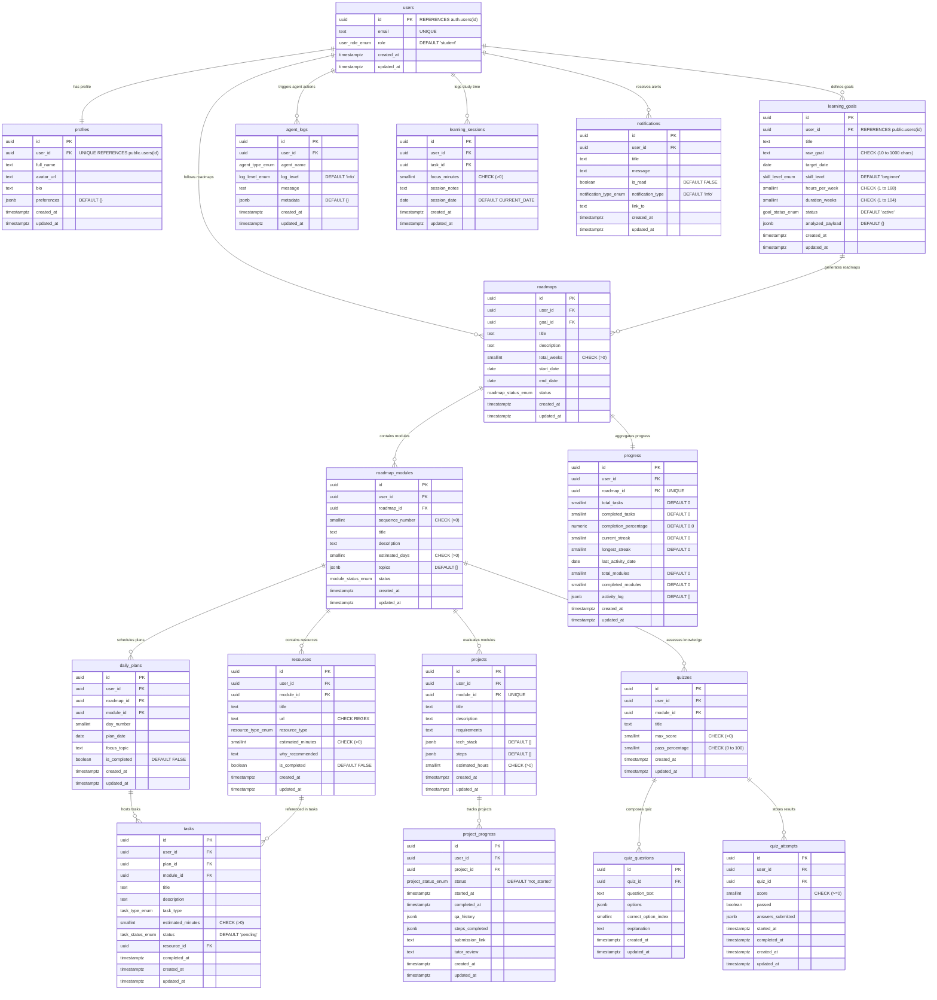

# SkillVerse Database Architecture

> **Version**: 2.0 — Production-Ready  
> **Database Engine**: PostgreSQL 15+ (Optimized for Supabase)  
> **Last Updated**: 2026-07-17  

---

## 1. Entity Relationship (ER) Diagram

Below is the visual map representing the 17 tables, their columns, keys, and relational cardinality.



---

## 2. PostgreSQL Enumerated Types (Enums)

We instantiate 13 strict types to reinforce relational integrity:
1. `user_role_enum`: Supports role-based access management (`student`, `admin`, `tutor`).
2. `skill_level_enum`: Standardized cognitive levels (`beginner`, `intermediate`, `advanced`).
3. `goal_status_enum`: Lifecycle of user learning aspirations (`active`, `completed`, `archived`).
4. `roadmap_status_enum`: States for a generated syllabus (`active`, `completed`, `paused`).
5. `module_status_enum`: Workflow status of a module (`not_started`, `in_progress`, `completed`).
6. `task_type_enum`: Modes of task completion (`read`, `watch`, `practice`, `build`, `quiz`).
7. `task_status_enum`: Completion state transitions (`pending`, `completed`).
8. `resource_type_enum`: Modality of materials (`article`, `video`, `course`, `documentation`, `tool`).
9. `project_status_enum`: Submission state for capstones (`not_started`, `in_progress`, `completed`).
10. `quiz_status_enum`: Accessibility states (`draft`, `published`, `completed`).
11. `agent_type_enum`: Strict naming for the 8 AI agents (`goal_analyzer`, `curriculum_architect`, `resource_curator`, `assessment_creator`, `study_planner`, `progress_tracker`, `interactive_tutor`, `orchestrator`).
12. `log_level_enum`: Standard logging thresholds (`info`, `warning`, `error`, `debug`).
13. `notification_type_enum`: Banner alert themes (`info`, `success`, `warning`, `achievement`).

---

## 3. Database Triggers (Automations)

### A. Auto-Updated Timestamps
All tables run an `update_updated_at_column()` trigger which automatically overwrites the `updated_at` column during row edits:
```sql
CREATE TRIGGER update_table_name_updated_at
  BEFORE UPDATE ON table_name
  FOR EACH ROW EXECUTE FUNCTION public.update_updated_at_column();
```

### B. Supabase Auth Synchronizer
When a user signs up on Supabase Auth, they are created in the core authenticated table (`auth.users`). We bind a trigger (`on_auth_user_created`) to automatically insert matching database rows into `public.users` and `public.profiles`, making authentication seamless.

### C. Automatic Progress Tracker
When a user marks a task completed (status set to `'completed'`), the `on_task_status_changed` trigger recalculates the total tasks, completed tasks, and `completion_percentage` in `public.progress` for the active roadmap. It also updates the module-count metrics and updates the `last_activity_date`.

---

## 4. Row Level Security (RLS) & Security Policies

Supabase requires defensive backend design. Therefore, **all 17 tables** have row level security enabled. Users are locked into sandbox visibility, using the following baseline policy matching:
- **Direct Ownership**: `auth.uid() = user_id` for profile, goals, roadmaps, modules, plans, tasks, progress, logs, sessions, and notifications.
- **Relational Access**: Tables without direct `user_id` links (like `quiz_questions`) utilize subquery verification:
  ```sql
  CREATE POLICY "Users read authorized quiz questions" ON public.quiz_questions 
    FOR SELECT USING (EXISTS (
      SELECT 1 FROM public.quizzes q WHERE q.id = quiz_id AND q.user_id = auth.uid()
    ));
  ```
- **Admin Elevation**: System administrators override restrictions using a role-based check:
  ```sql
  CREATE POLICY "Admins read all credentials" ON public.users 
    FOR SELECT USING (EXISTS (
      SELECT 1 FROM public.users u WHERE u.id = auth.uid() AND u.role = 'admin'::public.user_role_enum
    ));
  ```

---

## 5. Performance Tuning (Indexes)

To keep API requests snappy, b-tree indexes are compiled for all foreign-key lookups, composite lookups, and range searches.
For example:
- Unique index on `roadmap_modules(roadmap_id, sequence_number)` for curriculum lists.
- Composite index on `daily_plans(roadmap_id, day_number)` for plan lookups.
- Partial index on `notifications` to only scan unread alerts:
  ```sql
  CREATE INDEX idx_notifications_unread ON public.notifications(user_id) WHERE is_read = FALSE;
  ```

---

## 6. Accessing files

The schema files are stored locally in the workspace:
1. Schema Migration: [/supabase/migrations/20260717000000_init_skillverse_db.sql](file:///c:/Users/sravy/OneDrive/Desktop/SkillVerse/supabase/migrations/20260717000000_init_skillverse_db.sql)
2. Mock Seed Data: [/supabase/seed.sql](file:///c:/Users/sravy/OneDrive/Desktop/SkillVerse/supabase/seed.sql)
